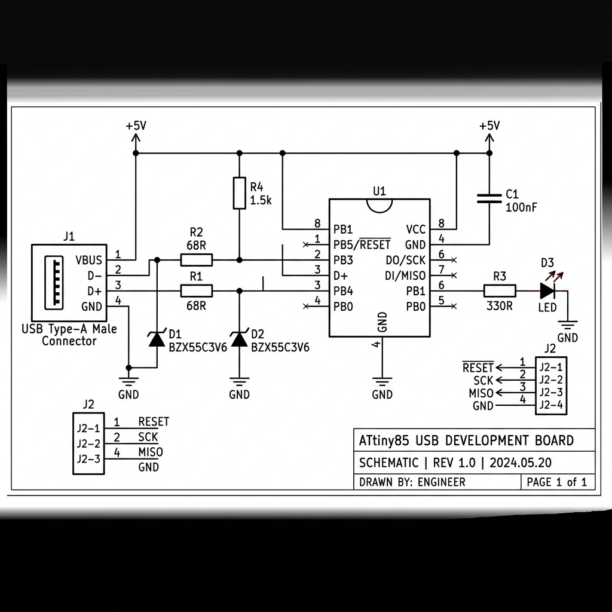

# ATtiny85 Custom USB Development Board

A custom PCB design and firmware for an **ATtiny85-based USB development board** using the **V-USB** software USB stack. The board plugs directly into a USB port and implements a USB HID device that can control an onboard LED from a host computer.

---

## 📐 Schematic Overview



| Component | Value | Purpose |
|-----------|-------|---------|
| **U1** | ATtiny85-20M (QFN-20) | Microcontroller — 8 kB Flash, 512 B SRAM |
| **J1** | 4-pin connector | USB interface (VCC, D−, D+, GND) |
| **J2** | 4-pin ISP header | In-system programming (RESET, SCK, MISO, GND) |
| **R1, R2** | 68 Ω | USB data-line series resistors |
| **R3** | 330 Ω | LED current-limiting resistor |
| **R4** | 1.5 kΩ | USB D− pull-up (low-speed device identification) |
| **D1, D2** | 3.6 V Zener | USB data-line voltage clamping (3.3 V logic levels) |
| **D3** | LED | Status / user-controllable indicator |
| **C1** | 100 nF | VCC decoupling capacitor |

### Pin Mapping

```
ATtiny85 (QFN-20)
┌────────────────┐
│ PB5/RESET (1)  │ ← ISP RESET
│ PB3/XTAL1 (2)  │ → USB D−  (via 68Ω → Zener 3.6V)
│ PB4/XTAL2 (5)  │ → USB D+  (via 68Ω → Zener 3.6V)
│ GND        (8) │ → Ground
│ PB0       (11)  │ → GPIO (on J1)
│ PB1       (12)  │ → LED  (via 330Ω → D3)
│ PB2       (14)  │ → GPIO (on J1)
│ VCC       (15)  │ → +5V (from USB VBUS)
└────────────────┘
```

---

## 🔧 Project Structure

```
ATtiny85_USB/
├── docs/
│   └── schematic.png        # Rendered schematic diagram
├── firmware/
│   ├── main.c              # USB LED controller firmware
│   ├── usbconfig.h         # V-USB configuration for this board
│   ├── Makefile             # Build & flash targets
│   └── usbdrv/             # V-USB library (stubs — see Setup)
│       ├── usbdrv.h
│       ├── usbdrv.c
│       ├── usbdrvasm.S
│       └── oddebug.c
├── host/
│   ├── host_led_control.py  # Python host-side USB control script
│   └── requirements.txt     # pip dependencies (pyusb)
├── Attiny85_USB.kicad_sch   # KiCad schematic
├── Attiny85_USB.kicad_pcb   # KiCad PCB layout (WIP)
├── Attiny85_USB.kicad_pro   # KiCad project file
├── LICENSE                  # GPL-2.0 (required by V-USB)
└── README.md
```

---

## 🚀 Getting Started

### Prerequisites

| Tool | Purpose |
|------|---------|
| `avr-gcc` | Cross-compiler for AVR microcontrollers |
| `avr-libc` | Standard C library for AVR |
| `avrdude` | Flash programmer utility |
| `USBasp` or similar | ISP programmer hardware |
| `python3` + `pyusb` | Host-side LED control (optional) |

On **Windows**, install [WinAVR](https://winavr.sourceforge.net/) or use the AVR toolchain bundled with the Arduino IDE.

On **Linux/macOS**:
```bash
# Debian/Ubuntu
sudo apt install gcc-avr avr-libc avrdude

# macOS (Homebrew)
brew install avr-gcc avrdude
```

### 1. Download the real V-USB library

The `firmware/usbdrv/` directory contains **stubs**. Replace them with the actual V-USB source:

```bash
cd firmware
rm -rf usbdrv
git clone https://github.com/obdev/v-usb.git v-usb-temp
cp -r v-usb-temp/usbdrv .
rm -rf v-usb-temp
```

### 2. Build the firmware

```bash
cd firmware
make
```

Expected output:
```
---- Firmware size ----
Program:    ~2048 bytes (25.0% Full)
Data:         ~64 bytes (12.5% Full)
```

### 3. Set fuses (first time only)

Configure the ATtiny85 to use the 16.5 MHz PLL clock:

```bash
make fuse
```

> ⚠️ **Warning:** Incorrect fuse settings can brick the chip. Double-check before running.

### 4. Flash the firmware

```bash
make flash
```

### 5. Test from host

Plug the board into a USB port. The LED should blink 3 times on startup.

```bash
cd ../host
pip install -r requirements.txt
python host_led_control.py toggle   # toggle LED
python host_led_control.py on       # LED on
python host_led_control.py off      # LED off
python host_led_control.py status   # read LED state
```

---

## 🔌 USB Protocol

The device uses **USB HID vendor requests** (no custom driver needed):

| Request | bRequest | wValue | Direction | Description |
|---------|----------|--------|-----------|-------------|
| SET LED | `0x01` | `0`=OFF, `1`=ON, `2`=TOGGLE | OUT | Set LED state |
| GET LED | `0x02` | — | IN (1 byte) | Read LED state |

USB identifiers (shared V-USB free-use IDs):
- **VID:** `0x16C0` — Van Ooijen Technische Informatica
- **PID:** `0x05DC` — obdev shared HID

---

## 📄 License

This project is licensed under the **GNU General Public License v2.0** — see the [LICENSE](LICENSE) file for details.

- **Firmware** (V-USB): GNU GPL v2 (as required by the V-USB license)
- **Hardware** (KiCad schematic/PCB): Open Hardware

---

## 🤝 Contributing

1. Fork this repository
2. Create a feature branch (`git checkout -b feature/my-feature`)
3. Commit your changes
4. Push and open a Pull Request
